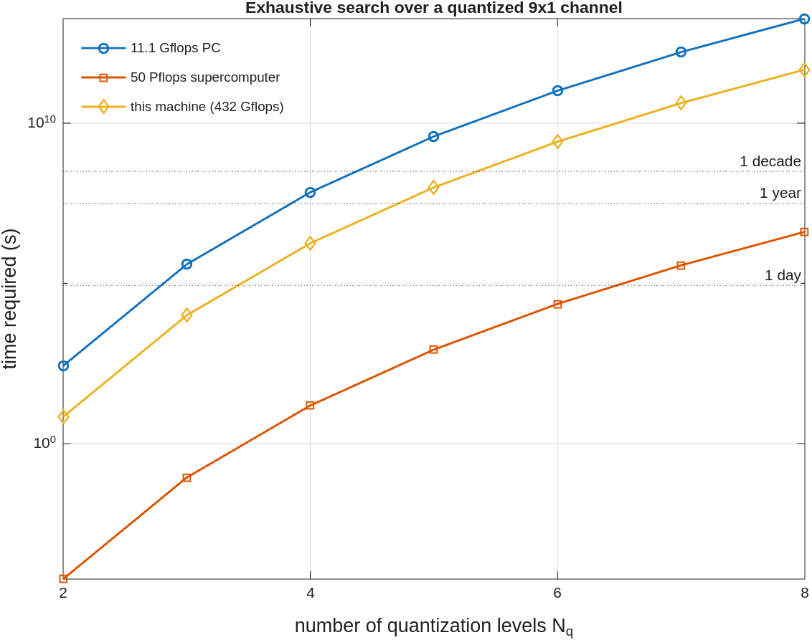

# Unconditional Secrecy and Computational Complexity against Wireless Eavesdropping

MATLAB code for the paper:

> **Y. Hua and A. Maksud**, "Unconditional Secrecy and Computational Complexity against Wireless Eavesdropping," in *Proc. IEEE 21st International Workshop on Signal Processing Advances in Wireless Communications (SPAWC)*, Atlanta, GA, USA, 2020, pp. 1-5. [[PDF]](https://intra.ece.ucr.edu/~yhua/SPAWC_2020_Reprint.pdf)

---

## Key result

The paper quantifies the *unconditional secrecy* (UNS) of several classic physical-layer schemes and the extra computation an eavesdropper (Eve) needs to break secrecy beyond it. Conventional MIMO beamforming gives UNS of at most the entropy of `r = min(N_A, N_B)` symbols, a randomized MISO beamformer (`N_A > N_B = 1`) at most `N_A - 1` symbols, and the artificial-noise scheme zero UNS. In each case Eve's extra work is a linear algebra problem she can solve. **Randomized Reciprocal Channel Modulation (RRCM)** instead forces Eve to solve a *nonlinear* inverse problem for the user's channel, and the paper shows the cost of that problem grows fast enough to be infeasible.

This repository holds the two simulations behind that claim:

- **Eve's Gauss-Newton attack (§VI-A).** For a small channel (`N_A = 4`) Eve can try to solve the nonlinear system directly. The reproduced sweep (1750 trials per noise level) shows this works only when channel reciprocity is nearly perfect. With reciprocity noise `sqrt(beta) = 0.03` Eve recovers the hidden channel samples in **44%** of trials, but this collapses to **5%** at `sqrt(beta) = 0.32` and to well under 1% beyond, with over 90% of attempts failing to converge.
- **Eve's search cost (paper Fig. 1).** For a 9x1 channel (`N_A = 9`), Eve's exhaustive search over a channel quantized to `N_q` levels per real component must evaluate `N_q^18` candidates, each a 3x3 SVD. Timing one 3x3 SVD on this machine gives `T_2 = 6.8 s` for the `N_q = 2` workload; scaling by `(N_q/2)^18` and to the paper's reference machines reproduces Fig. 1: at `N_q = 8` the search takes about `1.8e13 s` (~580,000 years) on the 11.1 Gflops PC and about `4e6 s` (~47 days) on a 50 Pflops supercomputer.

---

## Overview

Alice and Bob share a reciprocal wireless channel that Eve, at a different location, cannot observe. RRCM turns that shared channel into a one-time key. Let the user's reciprocal channel feature be a unit-norm vector

$$ x \in \mathbb{R}^{N}, \qquad \lVert x \rVert = 1 . $$

Bob's estimate of the same channel is imperfect by a reciprocity-noise fraction `beta`:

$$ x' = \sqrt{1-\beta}\, x + \sqrt{\beta}\, w, \qquad w \perp x, \quad \lVert w \rVert = 1 . $$

Alice publicly transmits randomized projections of `x` through random orthonormal tensors `Q_1, ..., Q_K`. Each public sample is the dominant eigenvector of `M M^T` with `M = [Q_{k,1} x, ..., Q_{k,L} x]`.
Bob, knowing his own `x'`, can align them.
Eve, who knows the public `Q_k` and the transmitted samples but not `x`, must invert a nonlinear map to recover the outer product `x x^T`. The paper's security argument is about how hard that inversion is.

## Method: Eve's attack (§VI-A)

1. Draw the secret `x` and the public tensors `Q_k`; form the public samples `Y = get_y(Q, x)`.
2. Provide Eve with the degraded outer product built from a noisy `x'` (`get_xbar_prime_from_xprime`).
3. Iterate the Gauss-Newton step (`SNS_B`), which linearizes the RRCM equations each step (`make_AaBb_algoB` assembling `make_Ax` / `make_Ay` / `make_Az`) and updates the estimate `x-hat <- x-hat - eta (B^T B)^{-1} B^T A (y_known - a)` until the residual on the known samples falls below `tol` or `my_iter` iterations pass.
4. Score the recovered `x-hat` (`my_quality_control`): did it match the *known* samples, and did it also predict the *hidden* samples (a genuine break)?

Repeating this over `RRR` trials at each reciprocity-noise level gives the attack-success curve.

## Results

**Paper Fig. 1: Eve's exhaustive-search cost.**

<p align="center"></p>
<p align="center"><sub>Time for Eve's exhaustive search over a quantized 9x1 channel vs. the number of quantization levels, on an 11.1 Gflops PC and a 50 Pflops supercomputer, with 1 day / 1 year / 1 decade references. Reconstructed from the measured cost of one 3x3 SVD.</sub></p>

**§VI-A: Eve's Gauss-Newton attack (`N_A = 4`, 11 known samples, 1750 trials per row).**

Values are percent of 1750 trials. `known_match` = Eve reproduces the samples she already sees; `hidden_break` = she also predicts the hidden samples (a genuine break); `not_converged` = the attack fails to settle. Raw counts for all five outcomes in [`results/attack_table_N4.csv`](results/attack_table_N4.csv).

| `sqrt_beta` | `beta` | `known_match` % | `hidden_break` % | `not_converged` % |
|------------:|-------:|----------------:|-----------------:|------------------:|
| 0.032 | 0.001 | 55.3 | **43.9** | 38.7 |
| 0.100 | 0.01  | 28.7 | **17.4** | 68.2 |
| 0.316 | 0.1   | 8.1  | **4.8**  | 90.2 |
| 0.447 | 0.2   | 4.9  | 2.2      | 94.7 |
| 0.548 | 0.3   | 3.3  | 1.1      | 96.2 |
| 0.632 | 0.4   | 2.5  | 1.2      | 97.2 |
| 0.707 | 0.5   | 1.8  | 0.6      | 98.1 |
| 0.775 | 0.6   | 1.3  | 0.8      | 98.6 |
| 0.837 | 0.7   | 1.4  | 0.5      | 98.3 |
| 0.894 | 0.8   | 1.1  | 0.3      | 98.6 |
| 0.949 | 0.9   | 1.1  | 0.4      | 98.9 |
| 1.000 | 1.0   | 1.1  | 0.4      | 98.9 |

Eve breaks RRCM only near perfect reciprocity. The break rate falls from 44% at `sqrt_beta = 0.03` to 5% at `0.32` and to well under 1% beyond, with over 90% of attempts failing to converge.

Note on scope: the SPAWC paper contains one figure (Fig. 1) and reports the §VI-A attack results in the text. The attack code here is the generalized RRCM/CEF form (Eve recovers the rank-1 lift `x x^T` from `K` known samples).

## Repository structure

```
.
├── reproduce_paper.m     # unifying driver: attack sweep + Fig. 1
├── results/              # generated tables (.mat) and figures (.png)
├── attaack_B.m           # original attack-sweep script (N=4)
├── SNS_B.m               # Eve's Gauss-Newton solver
├── make_AaBb_algoB.m     # assemble the per-iteration linearized system ...
├── make_Ax.m  make_Ay.m  make_Az.m          # ... its three blocks
├── gen_x_data.m  add_noise_b.m              # secret x and Bob's noisy copy x'
├── gen_Q_data.m  get_single_Q.m  get_y.m  get_single_y.m   # random transforms, public samples
├── get_xbar_prime_from_xprime.m  xbar_from_xhat.m  xhat0_from_xbar.m
├── MMt_from_xbar.m  get_ck_y_from_MMt.m  get_M.m           # x <-> x-bar <-> observation model
├── my_quality_control.m  my_cost_func.m  my_split_1.m  my_split_2.m
├── get_ind.m  split_check.m  allign_yy.m                   # score / split known vs hidden
├── my_QR.m  make_Qhat_k.m  make_Qtild_k.m  proces_D.m      # linear-algebra helpers
├── my_plot.m             # original plotting script for a saved table
├── parfor_progress.m     # third-party progress bar (J. Scheff)
└── my_beep.m
```

## Reproducing

Requires MATLAB (Parallel Computing Toolbox for `parfor`; Statistics Toolbox for `normrnd`). From the repo root:

```matlab
reproduce_paper                       % full run: attack sweep + Fig. 1
reproduce_paper('preset','smoke')     % fast end-to-end sanity check
reproduce_paper('only','fig1')        % just Figure 1
```

| Preset | Attack trials (RRR) | Noise levels | Newton iters | Fig. 1 SVDs timed | Runtime |
|--------|--------------------:|-------------:|-------------:|------------------:|---------|
| `smoke` | 3    | 3  | 500  | 2^12 | seconds |
| `quick` | 20   | 6  | 2000 | 2^15 | ~1 min  |
| `full`  | 100  | 12 | 7000 | 2^18 | ~14 min |
| `deep`  | 1750 | 12 | 7000 | 2^18 | ~3.5 h  |

Options: `'N',8` for the larger `N_A = 8` attack, `'workers',N` to size the pool, `'seed',S` for the base seed (trials are seeded per-trial, so results are identical regardless of worker count). Outputs land in `results/`: `attack_table_N4.csv` (+ `.mat`), `fig1_data.mat`, and `fig1_exhaustive_time.png`.

## Citation

```bibtex
@INPROCEEDINGS{9154267,
  author={Hua, Yingbo and Maksud, Ahmed},
  booktitle={2020 IEEE 21st International Workshop on Signal Processing Advances in Wireless Communications (SPAWC)}, 
  title={Unconditional Secrecy and Computational Complexity against Wireless Eavesdropping}, 
  year={2020},
  volume={},
  number={},
  pages={1-5},
  keywords={Wireless communication;Physical layer;Computational complexity;Communication system security;Encryption;Antennas;Network security;end-to-end security;privacy;physical layer security;unconditional secrecy},
  doi={10.1109/SPAWC48557.2020.9154267}}

```
